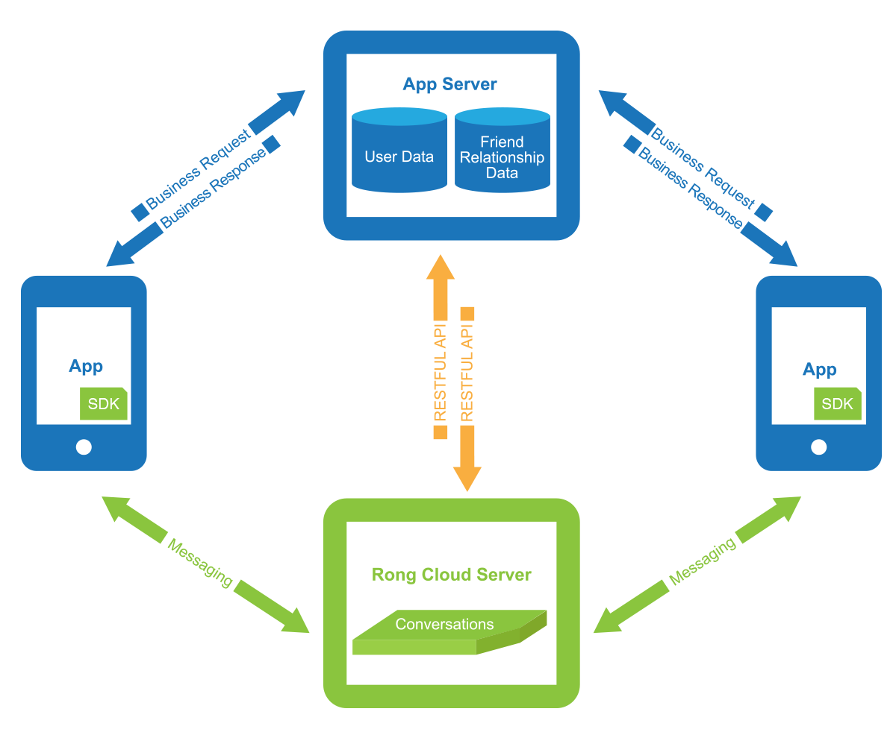
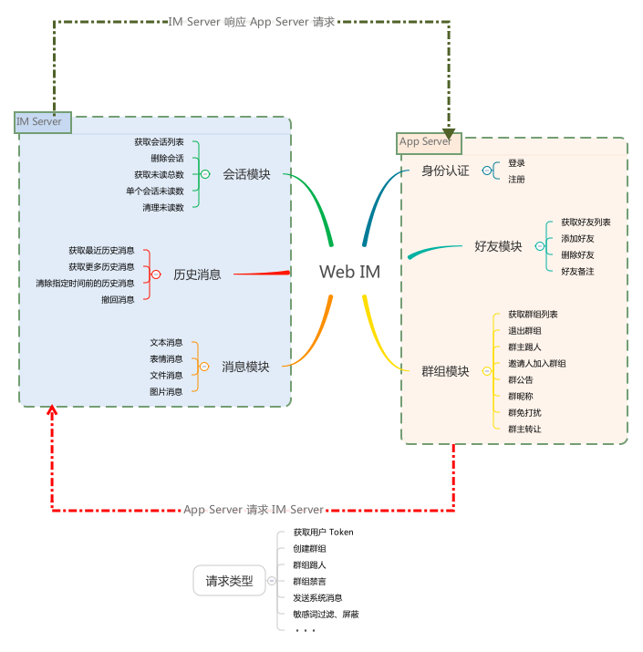
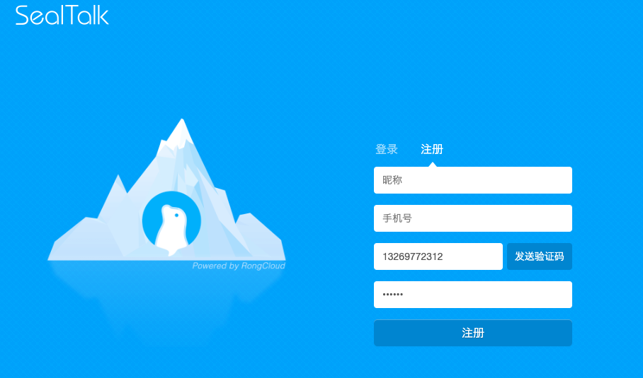
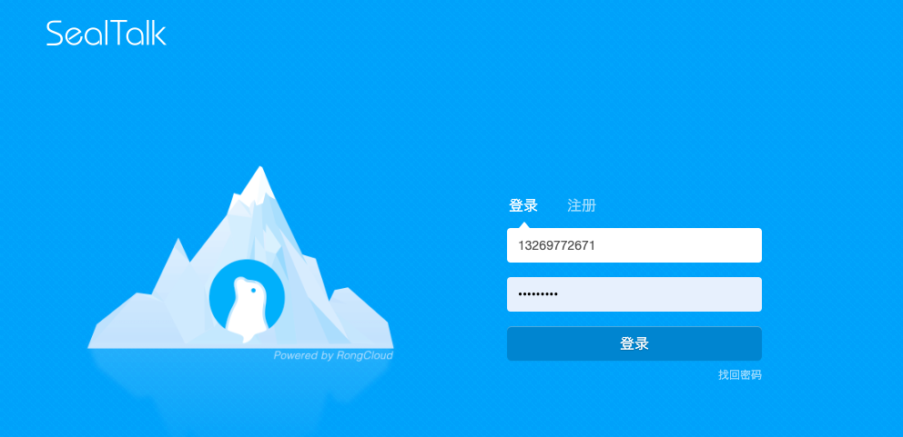

# Web IM 集成指南

## 融云架构介绍

Duration: 5:00

##### 架构介绍

蓝色为应用（App）和应用服务器（App Server），用户数据（User Data）和用户好友关系（Friend Relationship Data）保存在开发者的应用服务器上，融云不需要同步 App 的用户系统和好友关系

绿色为融云服务器（RongCloud Server）和融云 SDK，支持快速集成和平滑迁移

蓝色箭头表示开发者自己的业务数据由开发者自己的应用服务器保存

绿色箭头表示消息需要经过融云服务器转发

橙色箭头表示开发者的应用服务器和融云服务器通信，如获取用户 Token、同步群组关系

上图 + 开发者自定义 UI 组成了 Web IM

##### 名词介绍

_IM Server: `融云的 IM 云服务`_

_App Server: `开发者自己的应用服务器，用来管理登录、好友列表、群组关系`_

_App Key: `开发者可在融云创建多个应用，AppKey 是每个应用的唯一标识`_

_App Secret: `Secret 是每个应用的密钥，Secret 需妥善保管，切勿泄漏`_

_Token: `相当于 App 的用户连接融云的身份凭证，每个用户连接服务器都需要一个 Token，用户更换即需要更换 Token`_

## Web IM 架构

Duration: 8:00

通用 IM 需求包含以下模块，下图列出各模块基本功能及 App Server、IM Server 的关系

身份认证: _包含登录、注册功能、获取 Token 接口，此模块功能 `Web` 与 `App Server` 通信_

好友模块: _包含获取好友相关操作，此模块 `Web` 与 `App Server` 通信_

群组模块: _包含群组相关操作，此模块 `Web` 与 `App Server` 通信_

会话模块: _包含会话相关操作，此模块 `Web` 与 `IM Server` 及 `App Server 通信`_

历史消息: _包含历史消息相关操作，此模块 `Web` 与 `IM Server` 及 `App Server 通信`_

消息模块: _包含历消息发送操作，此模块 `Web` 与 `IM Server` 及 `App Server 通信`_

## 身份认证

Duration: 3:00

### 注册

**注册示例**:

**注册概述**:

1、此处用户注册为开发者自己的用户体系，与融云 IM Server 没有关系

2、与融云 IM Server 建立关系可通过 App Server 调用 [Server SDK 注册接口](https://www.rongcloud.cn/docs/server_sdk_api/user/user.html#register) 将此用户注册至 IM Server，后续方可发送消息 

3、App Server 调用 Server SDK API 注册成功后，将返回此用户在融云的令牌 Token，App Server 需将此 Token 存入数据库，方便登录使用

negative
: **备注**
Token 有过期时间，若 Token 过期，使用对应 userId 重新调用 [Server SDK 注册接口](https://www.rongcloud.cn/docs/server_sdk_api/user/user.html#register)  接口即可
分别为 永久、30 天、7 天、1 天，可在融云开发者后台 -> 应用 -> 服务管理设置，默认永久有效

### 登录

**登录示例**:

positive
: **登录概述**

### 身份认证与 Web IM SDK 的关系

登录、注册是开发者应用层逻辑，Web IM SDK 与 IM Server 建立连接的依据是 Token

Token 是每个用户在融云的唯一令牌，生成非常简单，请使用 [Server SDK](https://www.rongcloud.cn/docs/server_sdk_api/index.html) 获取

## 好友模块

Duration: 5:00

## 群组模块

Duration: 5:00

## 会话模块

Duration: 5:00

## 消息列表

Duration: 5:00

## 消息模块

Duration: 5:00