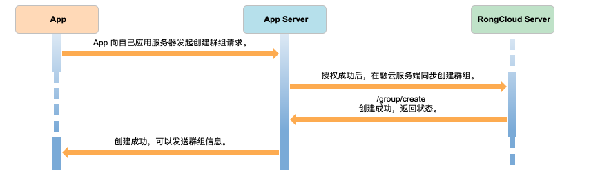
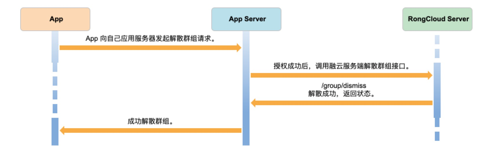
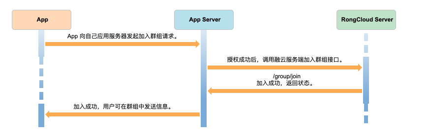
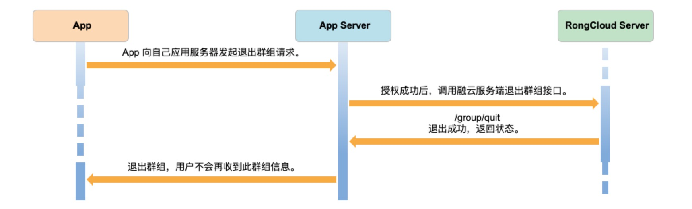
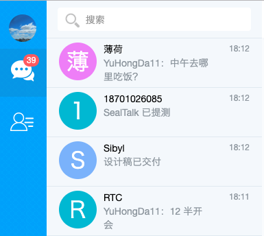
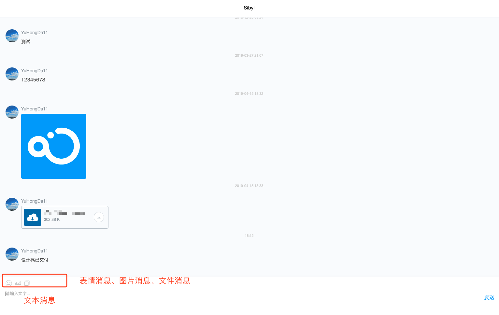

# Web IM 集成指南

## 融云架构介绍

Duration: 5:00

##### 架构介绍


蓝色为应用（App）和应用服务器（App Server），用户数据（User Data）和用户好友关系（Friend Relationship Data）保存在开发者的应用服务器上，融云不需要同步 App 的用户系统和好友关系

绿色为融云服务器（RongCloud Server）和融云 SDK，支持快速集成和平滑迁移

蓝色箭头表示开发者自己的业务数据由开发者自己的应用服务器保存

绿色箭头表示消息需要经过融云服务器转发

橙色箭头表示开发者的应用服务器和融云服务器通信，如获取用户 Token、同步群组关系

上图 + 开发者自定义 UI 组成了 Web IM

##### 名词介绍

_IM Server: `融云的 IM 云服务`_

_App Server: `开发者自己的应用服务器，用来管理登录、好友列表、群组关系`_

_App Key: `开发者可在融云创建多个应用，AppKey 是每个应用的唯一标识`_

_App Secret: `Secret 是每个应用的密钥，Secret 需妥善保管，切勿泄漏`_

_Token: `相当于 App 的用户连接融云的身份凭证，每个用户连接服务器都需要一个 Token，用户更换即需要更换 Token`_

## Web IM 架构

Duration: 8:00

通用 IM 需求包含以下模块，下图列出各模块基本功能及 App Server、IM Server 的关系


身份认证: _包含登录、注册功能、获取 Token 接口，此模块功能 `Web` 与 `App Server` 通信_

好友模块: _包含获取好友相关操作，此模块 `Web` 与 `App Server` 通信_

群组模块: _包含群组相关操作，此模块 `Web` 与 `App Server` 通信_

会话模块: _包含会话相关操作，此模块 `Web` 与 `IM Server` 及 `App Server 通信`_

历史消息: _包含历史消息相关操作，此模块 `Web` 与 `IM Server` 及 `App Server 通信`_

消息模块: _包含历消息发送操作，此模块 `Web` 与 `IM Server` 及 `App Server 通信`_

## 身份认证

Duration: 3:00

### 注册


1、用户注册为开发者自己的用户体系，与融云 IM Server 没有关系

2、截图示例使用手机号注册，开发者可按业务需求使用邮箱、用户名或其他注册方式

3、与融云 IM Server 建立关系可通过 App Server 调用 [Server SDK 注册接口](https://www.rongcloud.cn/docs/server_sdk_api/user/user.html#register) 将此用户注册至 IM Server，后续方可发送消息 

4、App Server 调用 Server SDK API 注册成功后，将返回此用户在融云的令牌 Token，App Server 需将此 Token 存入数据库，方便登录使用

negative
: **备注**
Token 有过期时间，若 Token 过期，使用对应 userId 重新调用 [Server SDK 注册接口](https://www.rongcloud.cn/docs/server_sdk_api/user/user.html#register)  接口即可
分别为 永久、30 天、7 天、1 天，可在融云开发者后台 -> 应用 -> 服务管理设置，默认永久有效

### 登录


1、登录需访问 App Server 校验，融云 IM 不关心用户密码是否正确，只校验连接时的 AppKey 和 Token

2、登录成功后可将此用户 Token 返回至 Web，方便当前用户连接 IM Server

### 身份认证与 Web IM SDK 的关系

登录、注册是开发者应用层逻辑，Web IM SDK 与 IM Server 建立连接的依据是 Token

Token 是每个用户在融云的唯一令牌，生成非常简单，请使用 [Server SDK](https://www.rongcloud.cn/docs/server_sdk_api/index.html) 获取

Web 获取到 Token 后，可初始化 IM SDK、进行连接操作，示例如下:

```js
var RongIMClient = RongIMLib.RongIMClient;
// 初始化 SDK，AppKey 可在融云开发者后台获取 https://developer.rongcloud.cn
RongIMClient.init('appkey');

// 设置状态监听
RongIMClient.setConnectionStatusListener({
  onChanged: function (status) {
  }
});

// 设置消息监听
RongIMClient.setOnReceiveMessageListener({
  onReceived: function (message) { 
  }
});

// 连接 IM Server
var token = "登录成功后返回的 IM Token";
RongIMClient.connect(token, {
  onSuccess: function(userId) {
  },
  onTokenIncorrect: function() {
  },
  onError: function(errorCode){
  }
});
```

初始化示例可参考: [https://rongcloud.github.io/websdk-demo/connect-check.html](https://rongcloud.github.io/websdk-demo/connect-check.html)

## 好友模块

Duration: 5:00

好友模块包含获取好友列表、添加好友、删除好友、好友备注，好友相关内容为 App 的业务数据，融云不关心是否为好友

有对方的 Id 即可发送消息

好友列表数据格式、添加权限开发者在 App、App Server 按自己的产品逻辑自定义即可

## 群组模块

Duration: 5:00

发起大于 2 人通话时可理解为群聊天（聊天室除外）

**创建群组**:



1、创建群组: Web 调用 App Server 创建群组， App Server 生成群组 Id、群关系

2、同步群组关系: App Server 调用 IM Server SDK [Group.create](https://www.rongcloud.cn/docs/server_sdk_api/group/group.html#create) 将群关系同步至融云 IM Server

3、建群成功

4、群成员 A 调用 Web IM SDK `sendMessage` 接口，群内成员将收到此条消息

**解散群组**:



1、解散群组: Web 调用 App Server 解散群组

2、同步群组关系: App Server 调用 IM Server SDK [Group.dismiss](https://www.rongcloud.cn/docs/server_sdk_api/group/group.html#dismiss) 将群关系同步至融云 IM Server

3、解散群组成功

4、此时用户将无法再向此群发送消息

**加入群组**:



1、加入群组: Web 调用 App Server 加入群组

2、同步群组关系: App Server 调用 IM Server SDK [Group.join](https://www.rongcloud.cn/docs/server_sdk_api/group/group.html#join) 将群关系同步至融云 IM Server

3、加入群组成功

4、此时此用户可向群组中发送消息

**退出群组**:

1、退出群组: Web 调用 App Server 退出群组

2、同步群组关系: App Server 调用 IM Server SDK [Group.quit](https://www.rongcloud.cn/docs/server_sdk_api/group/group.html#quit) 将群关系同步至融云 IM Server

3、退出群组成功

4、此时此用户再向群组中发送消息，sendMessage 接口将返回 _不在群组中_ 的状态提示



_更多群组操作:_ [https://www.rongcloud.cn/docs/server_sdk_api/group/group.html](https://www.rongcloud.cn/docs/server_sdk_api/group/group.html)

## 会话模块

Duration: 5:00



negative
: **提醒**
此功能需开通单群聊消息云存储，可在 融云开发者台 -> 应用 -> 高级功能 -> 开通单群聊消息云存储 开通
开通 2 小时后生效
开发者后台地址: [https://developer.rongcloud.cn](https://developer.rongcloud.cn)

会话列表由两部分数据组成 _会话列表_ 和 _业务数据_

会话列表: 当前用户与其他用户产生过会话，将会在融云 IM Server 存储，可通过 IM SDK [getConversationlist 接口](https://www.rongcloud.cn/docs/web.html#conversation_list) 获取

业务数据: 用户信息、群组关系，IM Server 存储会话列表中只包含群组 Id、用户 Id，需 Web 通过 App Server 获取对应数据组合后，渲染至页面

示例如下:

```js
var getUsers = (conversationList) => {
  // 1、过滤每个会话最后一条消息的发送人，向 App Server 请求获取
  // 2、conversationList 与 App Server 响应的用户信息合并数据
  return Promise.resolve(conversationList);
};
RongIMClient.getInstance().getConversationList({
  onSuccess: (conversationList) => {
    // 每个会话中包含最后一条消息、消息发送人、会话类型、未读消息数
    getUsers(conversationList).then( conversations => {
      // conversations 渲染至 UI
    });
  },
  onError: (error) => {
  }
}, null);
```

_更多会话列表操作:_ [https://www.rongcloud.cn/docs/web.html#conversation](https://www.rongcloud.cn/docs/web.html#conversation)

## 历史消息

Duration: 5:00

negative
: **提醒**
此功能需开通单群聊消息云存储，可在 融云开发者台 -> 应用 -> 高级功能 -> 开通单群聊消息云存储 开通
开通 2 小时后生效
开发者后台地址: [https://developer.rongcloud.cn](https://developer.rongcloud.cn)

历史消息由两部分数据组成 _历史消息_ 和 _业务数据_

历史消息列表: 当前用户与其他用户产生过消息，将会在融云 IM Server 存储，可通过 IM SDK [getConversationlist 接口](https://www.rongcloud.cn/docs/web.html#conversation_list) 获取

业务数据: 用户信息、群组关系，IM Server 存储消息列表中只包含群组 Id、用户 Id、内容，需 Web 通过 App Server 获取对应数据组合后，渲染至页面

获取最近的历史消息:

```js
var getUsers = (messages) => {
  // 1、通过每条消息的 sendUserId、targetId，向 App Server 请求获取
  // 2、messages 与 App Server 响应的用户信息合并数据
  return Promise.resolve(messages);
};

// 会话类型
let conversationType = RongIMLib.ConversationType.PRIVATE;
// 获取与用户 A 的历史消息，此处填写 A 的 userId
let targetId = 'A 的 userId';
let timestamp = null;
let count = 20;
let im = RongIMLib.RongIMClient.getInstance();
im.getHistoryMessages(conversationType, targetId, timestamp, count, {
  onSuccess: function(messages, hasMsg) {
    getUsers(messages).then(messages => {
      // messages 渲染至 UI
    });
  },
  onError: function(error) {
  }
});
```

## 消息模块

Duration: 5:00



Web IM SDK 支持发送多种消息，如文本、图片、文件、表情或自定义消息

发送示例:

```js
var msg = new RongIMLib.TextMessage({ content: 'Hello RongCloud'});
// 会话类型
var conversationType = RongIMLib.ConversationType.PRIVATE;
// 获取与用户 A 的历史消息，此处填写 A 的 userId
var targetId = 'A 的 userId';
RongIMClient.getInstance().sendMessage(conversationType, targetId, msg, {
  onSuccess: function (message) {
    // 消息发送成功后，将自己发送消息渲染至 UI，可根据 message.messageDirection 区分是发送方、接受方
  },
  onError: function (error) {
  }
});
```

_更多发送消息接口参考:_ [https://www.rongcloud.cn/docs/web.html#message_send](https://www.rongcloud.cn/docs/web.html#message_send)

## 相关文档

Duration: 1:00

SealTalk Web: [https://github.com/sealtalk/sealtalk-web](https://github.com/sealtalk/sealtalk-web)

SealTalk Server: [https://github.com/sealtalk/sealtalk-server](https://github.com/sealtalk/sealtalk-server)

Web IM SDK 开发指南: [https://www.rongcloud.cn/docs/web.html](https://www.rongcloud.cn/docs/web.html)

Web IM SDK API 示例: [https://rongcloud.github.io/websdk-demo/api-test.html](https://rongcloud.github.io/websdk-demo/api-test.html)