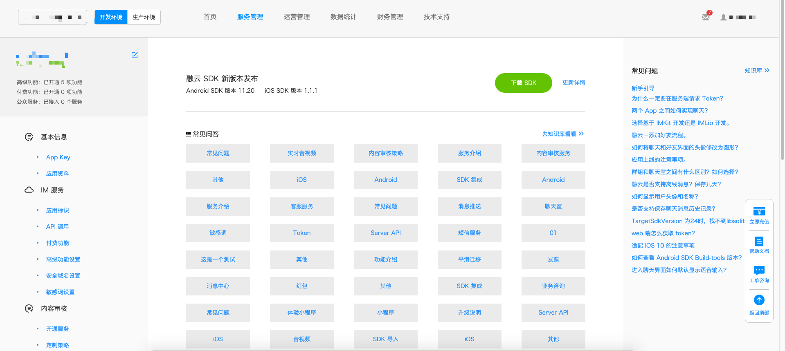

# SealRTC Web

## 前期准备

Duration: 5:00

SealRTC Web 是基于 [RongCloud Web RTC 3.0](https://www.rongcloud.cn/docs/web_rtclib.html) 的音视频示例，通过此示例，可更好的帮助您集成、使用 Web RTC SDK

#### 创建应用

1、移步融云开发者后台: [https://developer.rongcloud.cn](https://developer.rongcloud.cn)

2、输入必要信息注册用户


3、首次登录融云开发者后台



4、创建应用

#### 开通服务


## SealRTC Server

Duration: 5:00

**下载并安装 Node.js**

 Node.js 最低版本为 [6.5+](http://nodejs.cn/download/)，如果机器已安装 Node ，可使用 [NVM](https://github.com/creationix/nvm) 切换版本

**源码**

1、下载 SealRTC Server 源码

```bash
git clone https://github.com/rongcloud/sealrtc-server.git
```

2、进入 sealrtc-server 根目录执行

```bash
npm install
```

3、修改 `src/conf.js` 

```js
module.exports = {
  // 融云应用 AppKey，可在融云开发者后台获取
  RONGCLOUD_APPKEY: '',
  // 融云应用 Secret，可在融云开发者后台获取
  RONGCLOUD_SECRET: '',
  // Debug 模式开启万能验证码，发送验证码并不会收到验证码，验证时输入任意 4 位数字即可
  DEBUG: true,
  // 验证码默认使用云片，DEBUG 为 true 此项可为空，可您按实际需求配置，云片官网: https://www.yunpian.com/
  YUNPIAN_API_KEY: '',
  // 启动服务端口，可按需修改，避免冲突即可
  SERVER_PORT: '8585'
};
```

**启动服务**

1、启动服务

`sealrtc-server` 根目录执行以下命令启动服务

```
npm run serve
```

启动成功后出现本地地址及端口，`http://localhost:port` 将会在 SealRTC Web 中使用


## SealRTC Web

Duration: 5:00

**源码**

1、下载 SealRTC Web 源码

```bash
git clone https://github.com/rongcloud/sealrtc-web.git
```

2、修改配置 `src/config.js`

```js
win.RongSeal.Config = {
    // 融云应用 AppKey，可在融云开发者后台获取
    APPKEY: 'z3v5yqkbv8v30',
    // SealRTC Server 地址
    URL: 'http://localhost:8585/',
    // 屏幕共享插件下载地址，默认即可
    DOWNLOAD_SHARE_PLUGIN_URL: 'plugin/screenshare-addon.zip'
};
```

**启动服务**

浏览器限制协议必须是 `HTTPS` 或 `http://localhost:port` 方可使用摄像头、麦克风

所以需准备本地服务，若无本地服务推荐: [Nginx](http://nginx.org/en/download.html) 或 [Node.js Puer](https://www.npmjs.com/package/puer)

以 Puer 为例启动服务器

1、全局安装 puer

```bash
npm install puer -g
```

2、打开命令行 `sealrtc-web` 根目录

```bash
puer
```

启动成功后出现如下界面


## 演示示例

Duration: 3:00

#### SealRTC Web 浏览器兼容性说明


1、在上述浏览器任意一个中使用两个 Tab 页面分别打开 `http://localhost:8000/src/index.html` 或您自定义的端口 `http://localhost:port/src/index.html`


2、输入必要信息，点击开始会议


3、若需要手机号验证，点击发送验证码后，输入任意验证码通过验证，如：`9999`


4、开始音视频


## 相关文档

Duration: 1:00

Web RTC SDK 开发指南: [https://www.rongcloud.cn/docs/web_rtclib.html](https://www.rongcloud.cn/docs/web_rtclib.html)

融云知识库: [https://support.rongcloud.cn](https://support.rongcloud.cn)

融云开发者后台: [https://developer.rongcloud.cn](https://developer.rongcloud.cn)

